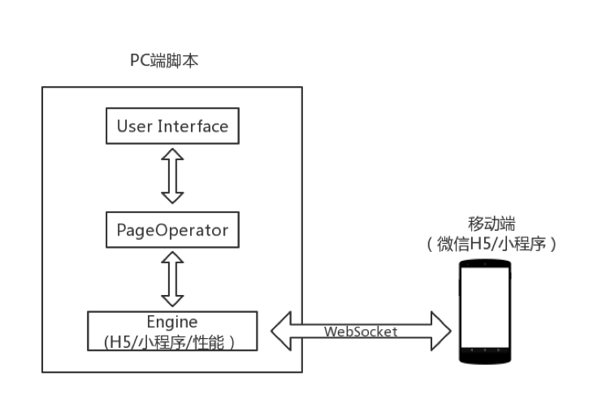
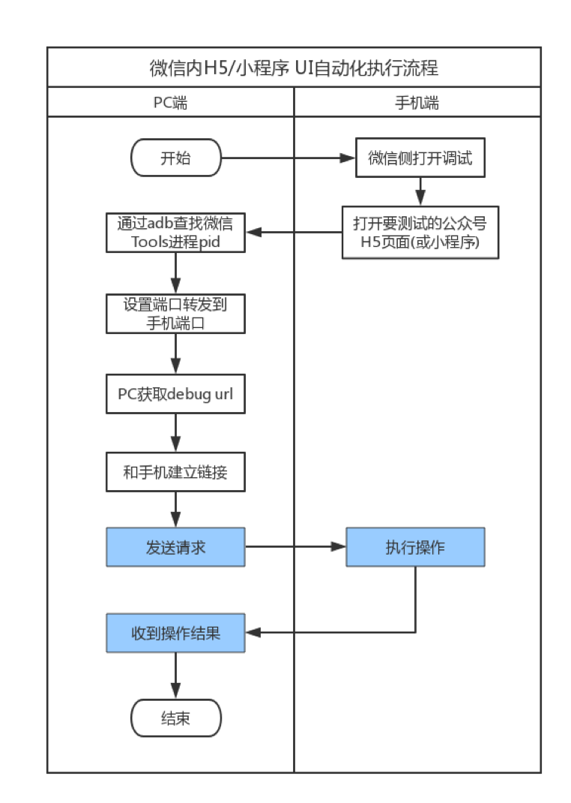
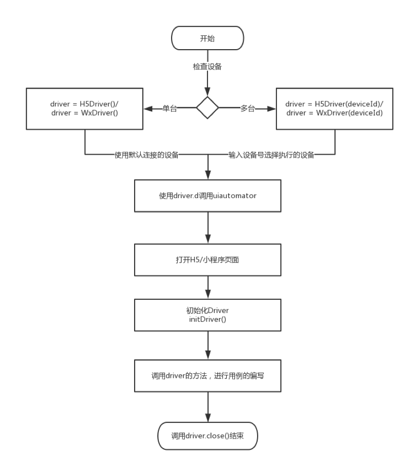

# FAutoTest

> 一个 H5、小程序自动化测试框架

## 简介

随着产品业务形态逐渐从 App 延升到微信小程序、微信公众号以及 QQ公众号等，而之前的自动化建设主要是 Native App 为主，全手工测试已无法满足快速增长的业务需求。为提升测试效率和质量，FAutoTest 框架致力于解决 QQ、微信内 UI 的自动化问题（包括微信内 H5页面和小程序、QQ 内 H5页面），提升自动化测试的效率和稳定性。

FAutoTest 是一款成长中的框架，吸收借鉴了一些 UI 自动化工具的优秀设计理念和思想。如果框架有不足地方，或者你有更好的建议，欢迎提交 Issues 参与贡献。

### 特性

FAutoTest 专业服务于微信 H5/小程序的UI自动化测试，提升测试效率与质量。

* 支持微信 H5页面，能识别常见 H5控件，能获取页面任意内容（常见的如文字、图片、链接等）
* 支持小程序内控件识别，操作，页面内容获取等
* 支持安卓 Native 页面组合操作使用
* 简单的 API 设计，较低的使用门槛
* 支持基础的性能测试监控
* 功能扩展性强，扩展门槛低

### 架构 

1. 整体采用分层设计，API设计方式参考 WebDriver 

2. 整体框架是一个同步阻塞的模型：在一个线程中循环的执行 receive 方法，等待收到 response，发送消息后，阻塞，只有当 receive 方法获得消息时，才会解除阻塞，发送下一条消息，具备超时异常处理机制

3. 框架内打包了 Python 版本的 UIAutomator，方便在安卓 Native 页面进行操作

  

   **User Interface(用户交互层)：** 提供给用户所有的界面操作 API(H5界面及小程序界面)，使用者不需要关注框架内部实现，只需要关注自身业务逻辑流程（手工用例流程转换成自动化流程）

   **PageOperator(操作解析层)：** 主要用于接收和解析用户命令后传递给下层 Engine 层

   **Engine( H5&小程序引擎层)：** 将用户命令传输到手机，并返回结果信息。封装 WebSocket 和单线程池，通过WebSocket Debug URL 和浏览器内核建立链接，发送 Json 格式的协议到手机端进行用户指定的操作。

### 业务流程

* H5页面/小程序 UI 自动化执行流程

  

* 自动化脚本调用流程

  

## 依赖软件环境

| 软件               | 软件要求                |
| ------------------ | ----------------------- |
| Python 版本         | 2.7.x 版本              |
| Java JDK 版本       | Java 语言框架（最低1.7） |
| Android SDK 版本    | 4.4 及以上版本           |
| adb 版本            | 最新版本即可            |
| Python IDE 开发环境 | 如 PyCharm CE等          |

#### 1. Python 版本安装

下载 & 安装 [Python](https://www.Python.org/downloads/)，安装后在终端输入命令 `python -v` 和 `pip list`，能够执行，说明 Python 环境配置成功。


#### 2. Java JDK 版本安装

下载 & 安装 [Java JDK](http://www.oracle.com/technetwork/java/javase/downloads/index.html) 安装后在终端输入命令`java -version`，`java`, `javac`命令能够执行，则 Java 环境配置成功。


#### 3. Android SDK 版本安装

下载 & 安装 [Android Studio](https://developer.android.com/studio/)，然后在里面安装 `Android SDK`

#### 4. 配置 adb 环境

安装 Android Studio 后，配置 SDK 环境（若自动安装不成功，可到[手动下载安装](http://developer.android.com/sdk/index.html) ，安装后在终端输入命令 `adb version` 执行有结果，则说明配置成功

#### 5. IDE 安装

下载 & 安装 [Pycharm CE](https://www.jetbrains.com/pycharm/download/)

## FAutoTest 开发环境安装 

| 库名称           | 版本   | 下载地址                                         |
| ---------------- | ------ | ------------------------------------------------ |
| uiautomator      | 0.3.2  | https://pypi.org/project/uiautomator/#files      |
| lxml             | 4.2.3  | https://pypi.org/project/lxml/4.2.3/#files       |
| bidict           | 0.17.0 | https://pypi.org/project/bidict/#files           |
| websocket-client | 0.44.0 | https://pypi.org/project/websocket-client/#files |

* 使用`pip`安装框架所需的第三方库 `uiautomator`、`websocket-client`、`lxml`、`bidict`，如安装`lxml`、`bidict`、`websocket-client`可用`pip`形式安装，如安装`lxml`，

  ```
  pip install lxml
  ```

* 安装自身框架

  ```
  pip install dist/fastAutoTest-xxx.whl(whl文件请在dist目录下手动下载)
  ```

* 打开微信Debug模式，安装 TBS 内核
  * 可在微信中打开 X5 调试地址：[http://debugx5.qq.com](http://debugx5.qq.com)
  * TBS 内核安装地址：[http://debugtbs.qq.com](http://debugtbs.qq.com)
  * 详情方式见：[http://x5.tencent.com/tbs/guide/debug/faq.html](http://x5.tencent.com/tbs/guide/debug/faq.html)

## 使用方式

如何写测试案例，如微信 H5页面，如下所示：

```Python
# coding=utf-8
from fastAutoTest.core.h5.h5Engine import H5Driver

# http://h5.baike.qq.com/mobile/enter.html 从微信进入此链接，首屏加载完后执行脚本
if __name__ == '__main__':
    h5Driver = H5Driver()
    h5Driver.initDriver()
    h5Driver.clickElementByXpath('/html/body/div[1]/div/div[3]/p')
    h5Driver.clickFirstElementByText('白内障')
    h5Driver.returnLastPage()
    h5Driver.returnLastPage()
    print(h5Driver.getElementTextByXpath('/html/body/div[1]/div/div[3]/p'))
    h5Driver.close()

```

1. 从微信初始化 H5页面，如进入 [http://h5.baike.qq.com/mobile/enter.html](http://h5.baike.qq.com/mobile/enter.html)
2. 进入页面后找到需要操作的控件的`xpath`，可通过 `chrome:inspect` 找到当前页面，找到控件的`xpath`
3. 初始化框架并进行 API 调用，如执行点击控件等
4. 关闭框架，执行用例

QQ 的 H5页面：

```Python
# coding=utf-8
from fastAutoTest.core.qq.qqEngine import QQDriver

# 从动态 -> 动漫进入
if __name__ == '__main__':
    qqDriver = QQDriver()
    qqDriver.initDriver()
    qqDriver.clickFirstElementByText('英雄救美，这也太浪漫了')
    qqDriver.returnLastPage()
    qqDriver.clickElementByXpath('//*[@id="app"]/div/ul/li[2]')
    qqDriver.returnLastPage()
    qqDriver.close()
```

1. 从 QQ 动态，进入动漫 H5页面
2. 找到需操作的控件的`xpath`，可通过 `chrome:inspect` 找到当前页面，找到控件的`xpath`
3. 初始化框架并进行相关 API 调用
4. 关闭框架，执行用例

微信小程序：

```Python
# coding=utf-8
from fastAutoTest.core.wx.wxEngine import WxDriver
import os

# 进入企鹅医典小程序
if __name__ == '__main__':
    wxDriver = WxDriver()
    wxDriver.initDriver()
    # 点击全部疾病
    wxDriver.clickElementByXpath('/html/body/div[1]/div/div[3]/p')
    wxDriver.clickFirstElementByText('白内障')
    wxDriver.returnLastPage()
    wxDriver.returnLastPage()
    # 截图
    dirPath = os.path.split(os.path.realpath(__file__))[0]
    PIC_SRC = os.path.join(dirPath, 'pic.png')
    wxDriver.d.screenshot(PIC_SRC)
    wxDriver.close()
```

1. 搜索小程序，如企鹅医典小程序，进入小程序页面
2. 同样找控件的`xpath`，同上操作
3. 初始化框架，进行相关 API 调用
4. 关闭框架，执行用例


## 后期计划

改造FAutoTest，兼容[QT4W](https://github.com/Tencent/QT4W)，实现FAutoTest到QTA的无缝切换。

## 交流群

交流群，请扫码加入下面群，验证回复 FAutoTest 按照指引进群。


## 相关链接

[CONTRIBUTING](CONTRIBUTING.md)

[IFRAME](docs/IFRAME.md)

[NOTICES](docs/NOTICES.md)

[APPENDIX](docs/APPENDIX.md)

[APIs](docs/APIS.md)

[QA](docs/QA.md)

## 贡献代码

如果你在使用过程中发现 Bug，请通过 Issues 或 Pull Requests 来提交反馈，或者加入交流群来解决。  
首次参与贡献请阅读：[CONTRIBUTING](CONTRIBUTING.md)

[腾讯开源激励计划](https://opensource.tencent.com/contribution) 鼓励开发者的参与和贡献，期待你的加入。

## License

所有代码采用 [BSD-3-Clause License](LICENSE.txt) 开源
