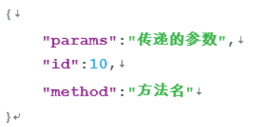
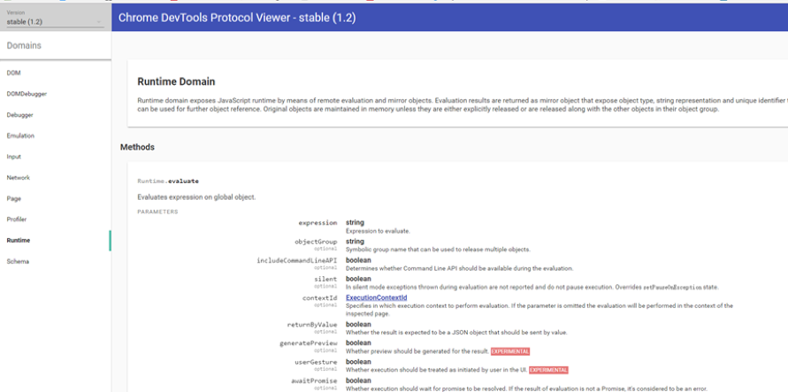
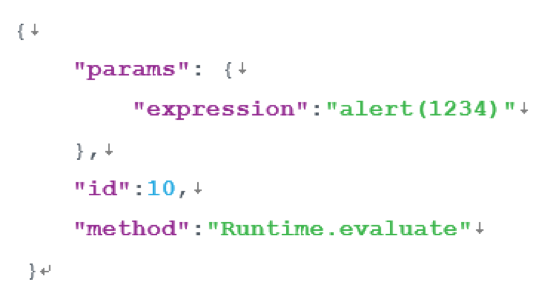
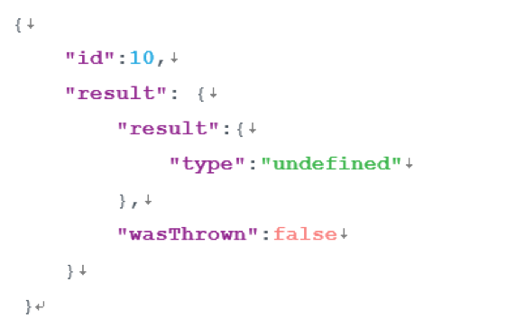

## Appendix

​        Chrome调试协议[Chrome Debugging Protocol]([*https://chromedevtools.github.io/devtools-protocol/)是Blink内核支持的调试协议，Chrome以及微信使用的QQ X5浏览器内核均在Blink基础上开发，Chrome F12以及常用的调试工具也是基于Chrome调试协议基础上开发。

### Chrome 调试协议格式

* **请求**

  .

> 1. Id：未使用，对于一次操作来说，请求id=响应id，id只是用来区分当前请求对应的响应
> 2. Method：要执行的操作，参见下面的模块域
> 3. Params：执行操作传递的参数，具体参见协议文档

* **响应**

.

> 1. Id：与请求id相同
> 2. Result：执行结果

* **模块域**

​        Google把要执行的操作按不同的功能模块域（[domains](https://chromedevtools.github.io/debugger-protocol-viewer/1-2/)）划分，以在页面上弹框为例：

​	Js弹窗操作对应Runtime域中Runtime.evaluate方法

​       

​	其中**发送请求**为：

.

**响应：**

.