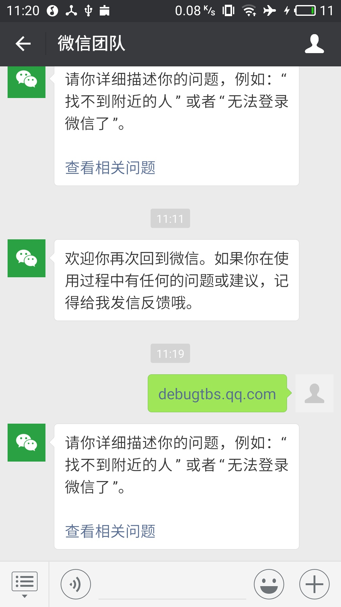
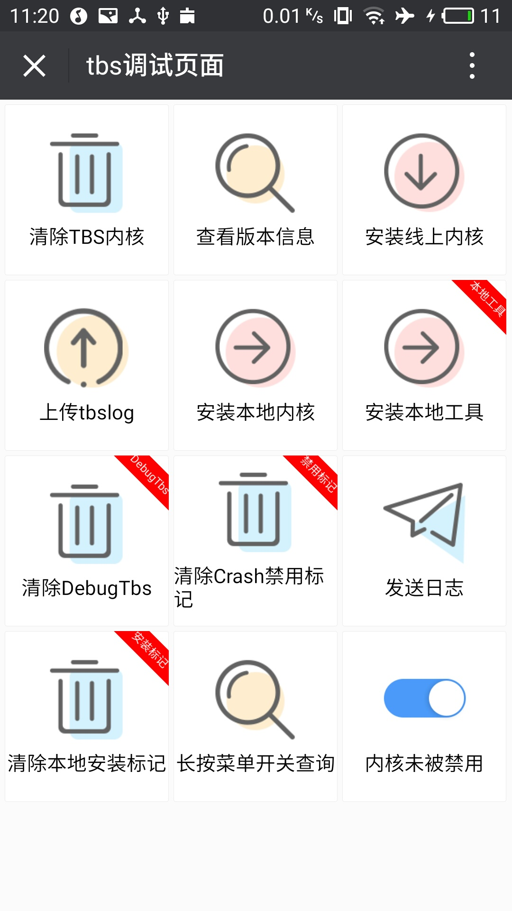
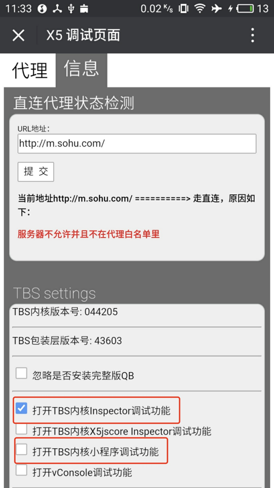
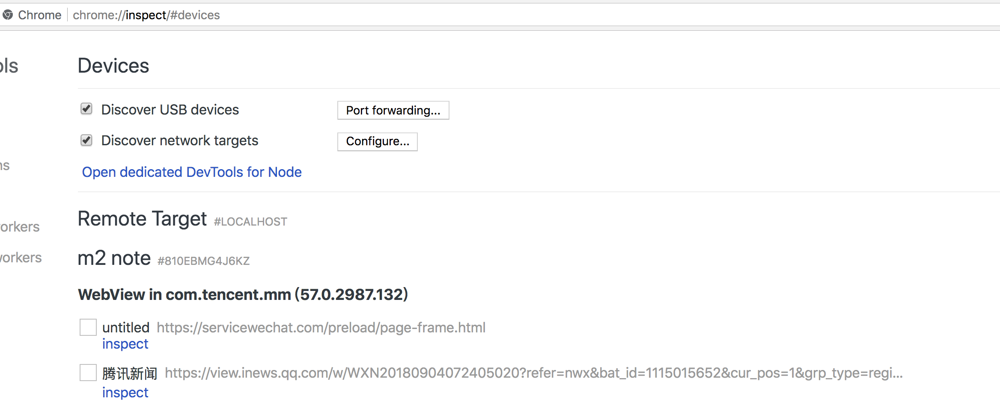

# 打开微信Debug模式

1. 点击任意一个聊天窗口

2. 发送消息 **debugtbs.qq.com**，并点击进入

   

3. 进入下图界面，点击安装线上内核

   

4. 安装成功后，继续发送消息 **debugx5.qq.com** ,并点击进入

5. 进入信息标签，勾选如下图两个选项

   

6. 之后，打开任意h5页面，在**chrome:inspect**中可以看到该页面的信息，说明开启成功。

   

