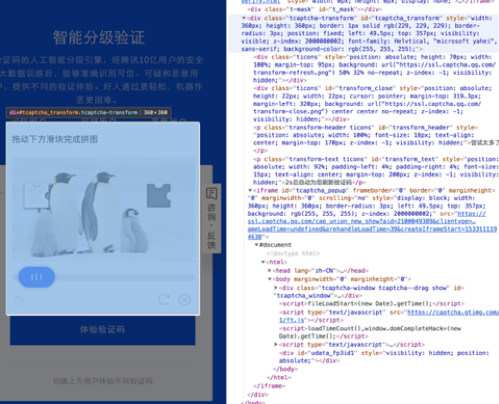
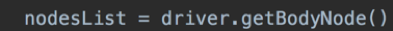
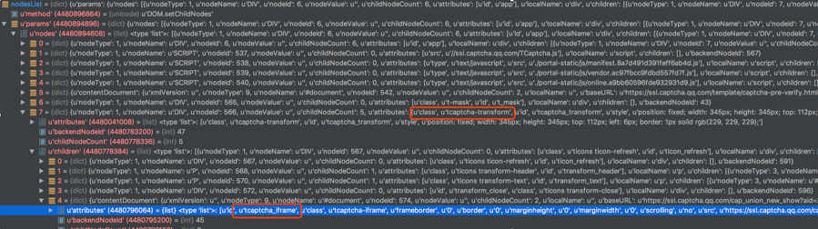
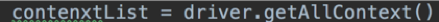
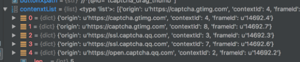
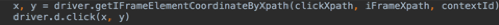
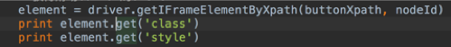

# 如何操作跨域的IFrame页面
- **https://open.captcha.qq.com/online.html 以该页面为例**

  1. 当点击体验验证码按钮后，如图所示：
     * 

  2. 待操作页面在一个跨域的IFrame中，要操作这个页面中的元素，必须先获取到该页面的**contextId** 。

     * 首先需要获取到IFrame的**frameId** 。
     * 调用方法，获取所有元素的Node信息。如图：
       * 
     * nodeLIst结果如图：
       * 
     * 通过HTML页面中的标签，对应获取到需要操作的IFrame页面的**frameId** 以及**nodeId** ：
       * 
     * 之后再调用下图方法：
       * 
     * 根据之前找到的**frameId** ，获取**contextId**
       * 
     * 对比上图，**contenxtId** 为7。

  3. 获取到id之后，可以调用方法进行点击，获取属性等，根据方法不同，传入**nodeId** 以及**ContextId**

     * 
     * 

